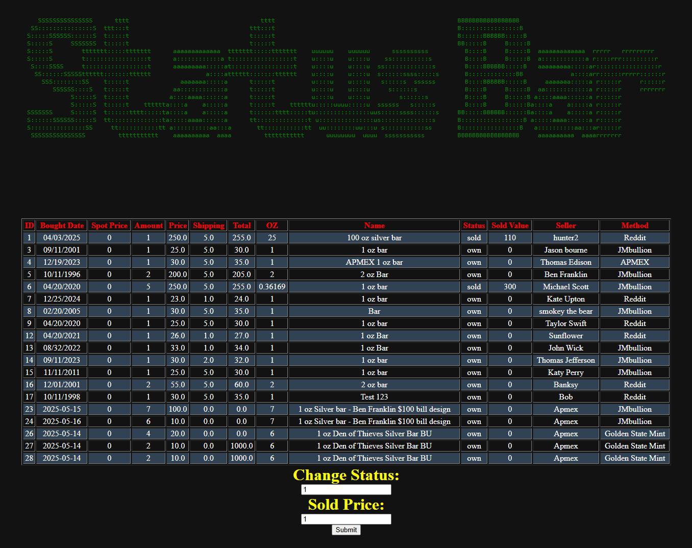
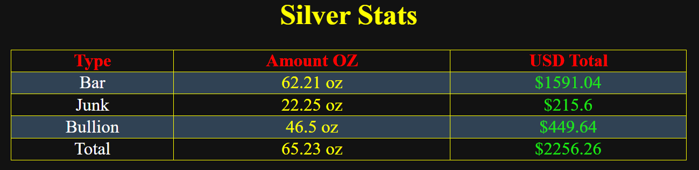

# SilverStats

Note that the database included and shown is not my real stack information. I do not want to show
that inforamtion because it's bad op sec.

## Menu 
This takes a number. Right now it is 1 through 18..

## Select Total
This feature will display all the total oz in Bullion, Junk and Bars tables. It will also use 
duckduck go search to display how much the silver total is in USD. 

## Price AVG
The image below shows that it will show text in red if there is a error with 
determining the avg. 

## Sold Total
Get the total of all Sold items. 

## Update Sold Value
Update the sold value. This is used when you sell one of your piece of silver. 

## Forecast Silver
This feature will take the inputed silver amount and use Duck Duck Go API to
get how much the amount of silver is worth in USD.  

## Back Up DB
This will back up the db by saving a copy of it with a new name.  

### WEBSITE

## Change Status
The status can either be `sold` or `own`. By entering the row ID it will automatically change the status via the current status. Like for example,
if the status is `sold` it will change to `own` and if it set to `own` it will change to `sold`.

## Delete Row

This page will display a nice html table that includes the row id. The user will
enter the row id which will delete the row. 

## Entering Silver
The enter silver page has three buttons, one to change status, delete a certain row and enter silver.

## Pie Charts
Shows the percentage of different types of sivler and cryptocurrency. 

## Cryptocurrency table
Reads from JSON file. Can be set by using `EXPORT=stats2.json`

## Silver Stats
Shows a nice table with the different types of silver amount in OZ and the amount in USD. 
